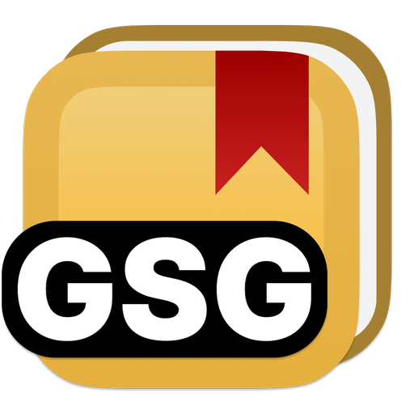
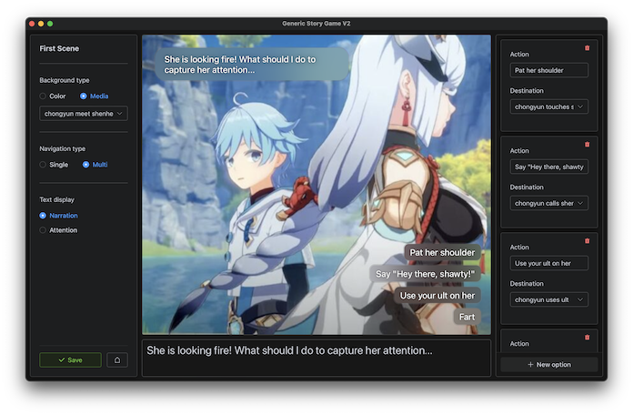

<!-- PROJECT LOGO -->
 

  

<h3 align="center">Generic Story Game V2</h3>

  

    Elegent visual story telling, made easy.
     
    <a href="https://github.com/wind-explorer/genericstorygamev2/releases/latest"><strong><h3>Go to Downloads »</h3></strong></a>
    <a href="https://github.com/wind-explorer/genericstorygamev2/issues">Report Bug</a>
    ·
    <a href="https://github.com/wind-explorer/genericstorygamev2/issues">Request Feature</a>
  

<!-- ABOUT THE PROJECT -->
## About The Project

<!-- [![Product Name Screen Shot][product-screenshot]](https://example.com) -->

You've got a creative mind for visual novels, but you are struggling to understand how those visual novel creator software out there works.

Introducing Generic Story Game V2, a simple visual novel software that lets you focus less on the technical matters, and more on expressing yourself with your creations.

### Elegant Story Player

### Intuitive Story Editor

(<a href="#readme-top">back to top</a>)

A software derived from the original GSG by Wind & Zhich.
